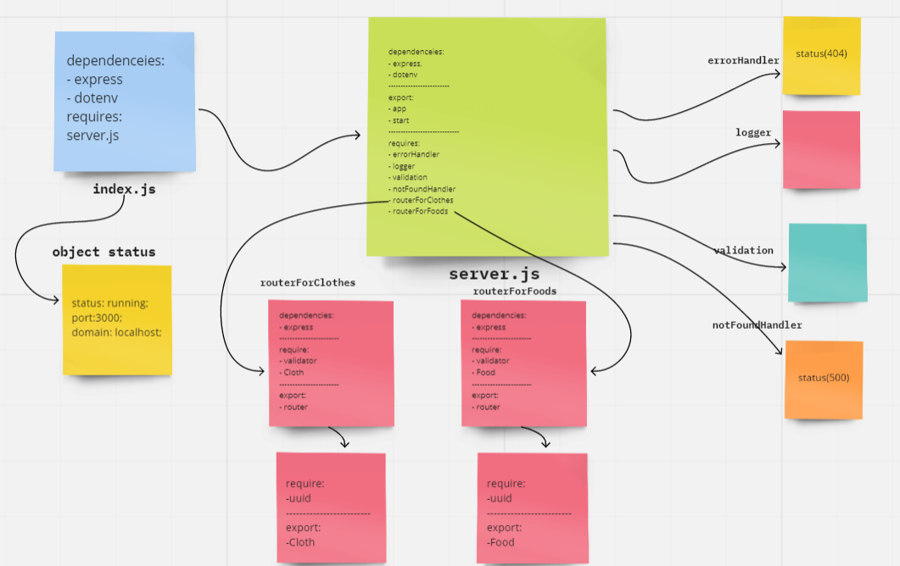

# LAB-3: Express REST API
#### REPO NAME: basic-api-server

## description

- Build a REST API using Express, by creating a proper series of endpoints that perform CRUD operations on a database, using the REST standard

- Create 2 in-memory data models(clothes, foods) using ES6 Classes, exported as Node Modules. And Define the field (type, price) 

- create a route module for each of the data models. 

- Within the router module create REST route handlers to  calls the correct CRUD method:
1- Add a record(POST)
2- Get All Records(GET)
3- Update A Record(PUT)
4- Delete A Record(DELETE)

## basic-express-server

Heroku app link:

GitHub actions link:

Pull Rrequest link:

## UML

